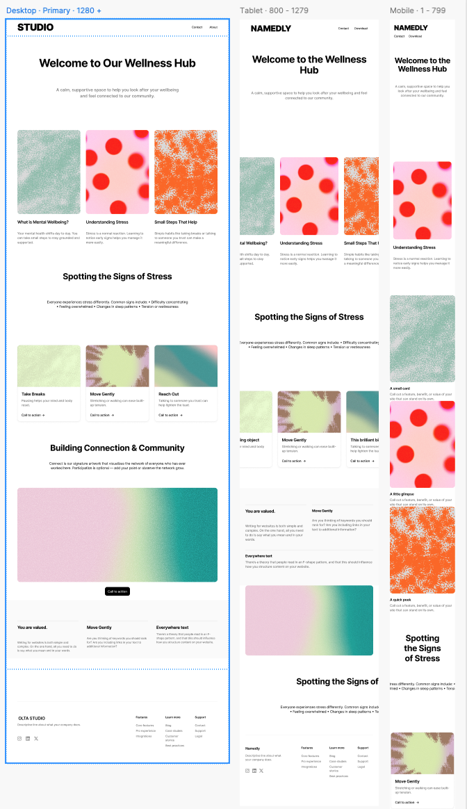

# Studio Wellness Hub

A modern, responsive webpage on a creative - tech studio website dedicated to mental wellness and stress management. Studio Wellness Hub provides a calm, supportive space with creative tech-forward design to help new and existing employees look after their wellbeing and feel connected to the studio's community.

## Project Overview

Studio Wellness Hub is a wellness-focused webpage that combines:

- **Mental health education** - Information about wellbeing, stress recognition, and coping strategies
- **Community connection** - Interactive artwork visualising network connections of all employees, partners and clients.
- **Modern design** - Creative studio aesthetic with soothing wellness color palette
- **Responsive layout** - Fully optimised for mobile, tablet, and desktop devices

## Design & Features

### Key Features

- **Hero Section** - Welcoming gradient intro with clear messaging
- **Info Cards** - Three main wellness topics with gradient backgrounds
- **Signs of Stress Section** - Educational content on recognizing stress symptoms
- **Interactive Connect Artwork** - Embedded iframe showcasing community network visualisation
- **Responsive Design** - Mobile-first approach with Bootstrap 5
- **Modern Navigation** - Sticky header with smooth hover effects
- **Fullscreen Support** - Interactive iframe with fullscreen capability

### Color Palette

The design uses a carefully curated wellness color palette:

- **Primary Colors**: Soft pastel blues (#A7C7E7), lavender (#C9B4E7), mint green (#B6E3C1)
- **Accent Colors**: Soft yellow (#FFE29C), coral (#FFB6A3)
- These colors evoke calm, balance, and positivity

## Tech Stack

- **HTML5** - Semantic markup structure
- **CSS3** - Modern gradients, flexbox, and responsive design
- **Bootstrap 5** - Responsive grid and components
- **JavaScript** - Interactive features (fullscreen toggle, responsive iframe)
- **Font Awesome** - Icon library for social media and UI elements
- **Google Fonts** - Inter, Space Grotesk, Plus Jakarta Sans (not used)

## Wireframe



## Project Structure

```
studio-wellness-hub/
├── index.html              # Main HTML file
├── assets/
│   ├── css/
│   │   └── style.css      # Custom stylesheets with gradient utilities
│   ├── images/            # Project image assets
│   └── look-dev/          # Design reference and development files
└── README.md              # This file


```

## Getting Started

### Prerequisites

- A modern web browser (Chrome, Firefox, Safari, Edge)
- Internet connection (for external CDN resources)

### Installation

<!-- Add this later -->

## Key CSS Classes & Utilities

### Wellness Gradient Classes

- `.gradient-wellness-warm` - Mint → yellow → coral

### Component Classes

- `.modern-header` - Sticky navigation with gradient background
- `.studio-logo` - Gradient text effect on logo
- `.card` - Info card with hover effects
- `.card-img-top` - Responsive card images with gradients
- `.hero` - Large hero section with centered content
- `.signs` - Section with wellness gradient background
- `.divider-*` - Decorative gradient line dividers
- `.fullscreen-btn` - Fullscreen toggle button (desktop only)

## Responsive Breakpoints

- **Mobile**: < 576px
- **Tablet**: 576px - 768px
- **Desktop**: > 768px

The design is optimized for all device sizes with CSS media queries and Bootstrap's responsive grid.

## Customization

### Changing Colors

Update the CSS variables in `style.css`:

```css
:root {
  --wellness-blue: #a7c7e7;
  --wellness-lavender: #c9b4e7;
  --wellness-mint: #b6e3c1;
  --wellness-yellow: #ffe29c;
  --wellness-coral: #ffb6a3;
}
```

### Modifying Gradients

Edit gradient classes in `style.css` to adjust angles, colors, and opacity values.

### Updating Content

Edit text, headings, and images directly in `index.html`.

## Browser Support

- Chrome/Edge: Latest 2 versions
- Firefox: Latest 2 versions
- Safari: Latest 2 versions
- Mobile browsers: iOS Safari, Chrome Mobile

## Future Enhancements

- [ ] Add more wellness resource pages
- [ ] Implement user accounts and progress tracking
- [ ] Add more interactive features and animations
- [ ] Create accessibility improvements (ARIA labels, keyboard navigation)
- [ ] Add multilingual support
- [ ] Implement dark mode toggle
- [ ] Add blog/resource section
- [ ] Connect external wellness APIs

## License

<!-- Not sure what to write here -->

## Author

**Terence Reilly**

- GitHub: [@terencereilly](https://github.com/terencereilly)
- Repository: [studio-wellness-hub](https://github.com/terencereilly/studio-wellness-hub)

## Acknowledgments

- Design inspiration from modern wellness and creative studio aesthetics
- Bootstrap 5 for responsive component framework
- Google Fonts for typography
- Font Awesome for icons
- Design references from contemporary digital design practices

## Contact & Support

For questions, suggestions, or issues, please open a GitHub issue or contact the author.

---

**Last Updated**: December 4, 2025
